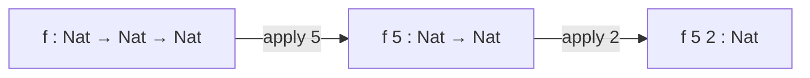
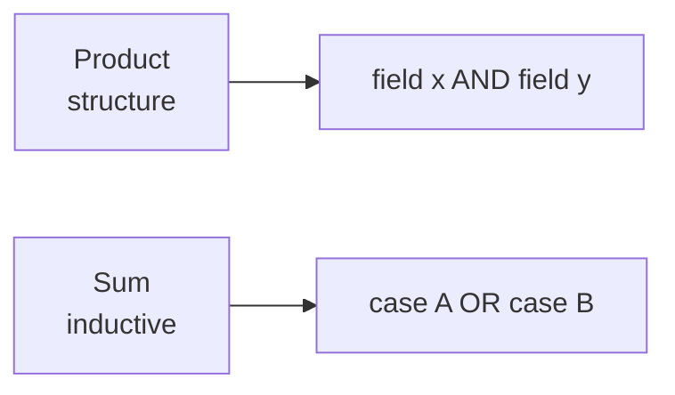

--- note Control Flow
Lean has no statements, only expressions. `if` and `match` both *evaluate to a
value*, which is why the `else` branch is not optional — an expression has to
have a value on every path.
--- presenter
Set the frame for the whole lecture: everything here is an expression, and by
the last section we will see that even `if` and `match` are sugar.

--- note If-Else
The else branch is mandatory because `if` is an expression: without it, there
would be no value when the condition is false. In an imperative language `if`
is a statement and can simply do nothing.
--- presenter
If someone asks "what about early return?", say it exists in `do` blocks and
we get there in the monads lecture.

--- note Match
`match` is the general form; `if` is the special case for `Bool`. The wildcard
`_` is a pattern that matches anything, and Lean checks the cases are
exhaustive — a missing case is a compile error, not a runtime surprise.
--- presenter
Worth showing what happens if you delete the wildcard. The error message is
good and it makes exhaustiveness concrete.

--- note Function Calls
Every function in Lean takes exactly one argument. `f x y` is `(f x) y`, and
`A → B → C` is `A → (B → C)`. Once that clicks, default arguments, named
arguments and partial application all stop looking like separate features.
--- presenter
This section is mostly syntax. Move briskly, but do not rush currying — the
rest of the course leans on it.

--- note Currying
Partial application falls straight out of one-argument functions: `f 5` has
simply not been given its second argument yet, so it is still a function.

--- presenter
Read the `#check` output aloud, left to right. The arrows disappearing one at a
time is the whole idea.

--- note Fold
A fold is the functional replacement for a loop that accumulates. `foldl` walks
left to right carrying an accumulator; the lambda takes the accumulator first
and the element second.
--- presenter
The leading space in the output is a nice accident — it shows the accumulator
started empty and the separator went on unconditionally.

--- note Recursion
Lean must prove your recursion terminates, because a non-terminating definition
would make the logic unsound: you could "prove" anything by looping forever.
Here it sees the argument shrink on each call.
--- presenter
Flag that `partial` is coming next and that it is an escape hatch with a real
cost.

--- note Recursion#2
`partial` tells Lean to stop trying to prove termination. The definition still
compiles and runs, but it is opaque to the logic — you cannot reason about it
in a proof.
--- presenter
"Use it for tooling, not for anything you intend to prove things about."

--- note Additional Conveniences
Nothing in this section adds power; it is all sugar over what we already have.
Worth knowing so the standard library reads easily.
--- presenter
Fast section. The exercise at the end is a good stopping point for a break.

--- note Structures
A structure is a product type: one value carries a field *and* another field.
The size of the type is the product of the sizes of its fields, which is where
the name comes from.
--- presenter
The Cartesian-product slide is the one-line justification for the name. Do not
belabour it.

--- note Inductive
An inductive is a sum type: a value is one case *or* another. Product and sum
together cover most data modelling — structures for "and", inductives for "or".

--- presenter
Contrast this directly with the previous section. "And" versus "or" is the
sentence people remember.

--- note Strict Positivity
The restriction exists to keep the logic consistent. A type that contains a
function *from* itself lets you build a non-terminating term, and from that you
can derive a proof of `False`.
--- presenter
Do not go down the Curry's-paradox rabbit hole here; point at the
computability lecture and move on.

--- note Recursors
This is the payoff section. Everything so far — `if`, `match`, pattern matching
in `let` — compiles down to a recursor that Lean generates automatically from
the inductive declaration.
--- presenter
Tell the room this is the "under the hood" part and that they will not write
recursors by hand often. It matters because proofs are built on them.

--- note The Motive
The motive is what makes a recursor more than a `switch`: the *result type* is
allowed to depend on which case you are in. That is what dependent types buy
you, and it is why the same machinery works for proofs.
--- presenter
The `if b then String else Nat` example is the whole point. Ask what the type
of the expression is before revealing it.

--- note Conclusion
Recursors are the primitive; `if` and `match` are elaborated into them. They
exist in the kernel's view of the term, not in compiled code — the compiler
turns them back into ordinary branching.
--- presenter
Close the loop with the opening claim: everything is an expression, and every
expression is built from a small core.
