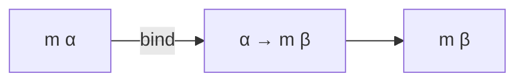
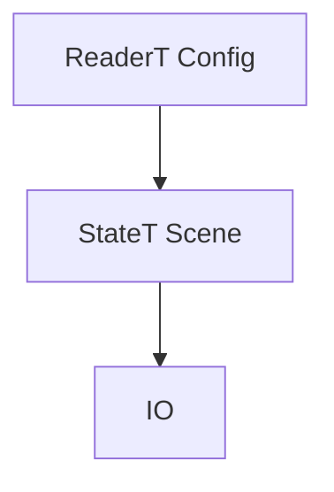

--- note Functors and Monads
Two problems motivate the whole lecture: a function that might fail, and a
function that touches the world. Both are solved by changing the *return type*
rather than adding a side effect.
--- presenter
Do not say the word "monad" until the Bind slide. Let the two problems sit
first — the abstraction is much easier to accept once both are on the board.

--- note Fallibility Problem
Returning `Option β` says "this might not produce anything" in the type. The
cost is that the caller now has to deal with the wrapper, which is exactly what
`bind` will automate.
--- presenter
This snippet does not compile as written — that is the point. Ask what is
wrong before moving on.

--- note Impurity Problem
Modelling a side effect as a return value turns "modifies the world" into
"takes a world and returns a new one". Purely functional, and the type records
that something happened.
--- presenter
The `??` in the type is deliberate. Ask the room to fill it in.

--- note Functor
`map` gets a function *into* the wrapper. It is not enough on its own: if the
function you are mapping itself returns a wrapped value, you end up with two
layers. Flattening that is `bind`.
--- presenter
Set up the nesting problem here; it makes `bind` feel inevitable rather than
arbitrary.

--- note Pure
`pure` is the way in: it takes a plain value and wraps it with no effect. It is
the identity element the monad laws are stated against.
--- presenter
One sentence is enough. `pure` only gets interesting alongside `bind`.

--- note Bind
`bind` is the one that matters. It runs the wrapped computation, hands the
unwrapped result to a function that returns another wrapped computation, and
gives you back a single layer.

--- presenter
Read the type aloud slowly. `m α → (α → m β) → m β` is the sentence the whole
lecture rests on.

--- note Monad
A monad is just `Functor` + `Pure` + `Bind` with laws. Note `map` gets a
default implementation in terms of `bind` — anything with `bind` and `pure`
already has `map`.
--- presenter
"A monad is a design pattern with a scary name." Then move on quickly.

--- note Monad Laws
Left and right identity say `pure` does nothing; associativity says how you
bracket a chain of binds does not matter. That last one is what lets
`do`-notation be a flat list of steps.
--- presenter
Tie associativity directly to `do`. It is the reason the sugar is sound.

--- note A Stateful Monad
`StateNatM α` is a function from a state to a pair. `bind` threads the state
through for you, which is the only thing that was tedious about doing it by
hand.
--- presenter
Trace the state through the two `#eval`s on the next slide with a finger. It is
worth the thirty seconds.

--- note Common Monads
The same three functions, different wrappers: `Option` for fallibility,
`ReaderM` for a fixed environment, `StateM` for a mutable one, `Id` for
nothing at all.
--- presenter
The point of this section is repetition. Say "same interface" every time.

--- note The do Notation
`do` is sugar for a chain of binds, nothing more. The next slide prints the
desugared form so nobody has to take that on faith.
--- presenter
Show the desugaring. Every audience has someone who does not believe it.

--- note Early Return
`return` inside `do` is `pure`, and an `if` without an `else` gets `pure ()`.
That is why an early `return` reads like an imperative one while staying an
expression.
--- presenter
Connect back to lecture 02: `if` still needs both branches, the sugar is just
supplying one.

--- note The ReaderM Monad
A reader carries a value nobody can modify — configuration, an environment, a
context. `read` retrieves it; `withReader` runs a sub-computation under a
different one.
--- presenter
Real use: passing a config through twenty functions without twenty extra
parameters.

--- note The StateM Monad
The state monad is the reader plus the ability to write. `get`, `set` and
`modifyGet` are the whole interface, and the plumbing is `bind`.
--- presenter
The linear congruential generator is a good example because the state is
obviously essential and obviously annoying to thread by hand.

--- note Loops
`for` and `while` in `do` blocks are not special syntax bolted on — they go
through the `ForIn` class, so they work for any type that implements it in any
monad.
--- presenter
Surprise value here: loops are a type class. Say it that way.

--- note Monad Transformers
A transformer adds one monad's ability to another. `ReaderT ρ m` is "a reader
on top of whatever `m` already does", so you can have a config *and* IO.

--- presenter
The stack diagram is worth drawing on the board too. Order matters and the next
slides show why.

--- note Monad Lifting
Lifting is what lets an inner monad's action be used in the outer stack without
manual wrapping. `MonadLift` instances exist for the standard transformers, so
it usually happens invisibly.
--- presenter
People hit this as a confusing error long before they understand it. Name it so
the error is recognisable later.

--- note OptionT and ExceptT
These add early exit to a monad that had none. `OptionT m α` is just
`m (Option α)` with a `bind` that stops at the first `none`.
--- presenter
Unfold the definition on the slide — it is four lines and it demystifies the
whole family.

--- note Ordering Monad Transformers
`T1 (T2 m)` and `T2 (T1 m)` are different types with different behaviour —
whether state survives a failure depends on which way round you stacked them.
--- presenter
Concrete question for the room: "if the computation fails, do we keep the
state?" The answer is: depends on the order.

--- note Supplementary: monad.lean
The handout builds the whole thing from scratch: a state-passing function,
then `seq`, then `bind`, then `pure`, and the instance falls out at the end.
Worth reading if the abstraction felt like it arrived from nowhere.
--- presenter
Recommend it explicitly to anyone who looked lost during the Bind slide.
