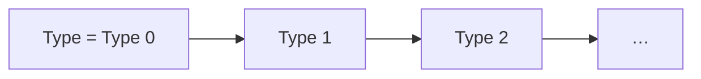

--- note Types
In Lean a type is an ordinary value, so functions can take and return types.
That single fact is what makes everything in this lecture — polymorphism,
universes, inductive families — one idea rather than several.
--- presenter
Resist the urge to define "dependent type" up front. Show `List` being a
function first; the name lands better afterwards.

--- note Dependent Types
`List` is not a type, it is a function from a type to a type. `List Nat` is the
type. Once you see that, `Type` needing its own type stops being surprising.
--- presenter
Ask what `#check List` will print before showing it. People usually expect
`Type`.

--- note Dependent Function Types
The image of the function depends on the argument, so the return type is not
fixed until you supply one. `duplicate` returns `List α` — a different type for
each `α` you hand it.
--- presenter
Point at the `{α}` braces and promise to explain implicit arguments properly
when we get to instance arguments.

--- note Type Universes
Universes exist to stop `Type : Type`, which would let you reproduce Russell's
paradox and prove anything. Each level lives in the next one up, forever.

--- presenter
Nobody enjoys universes. Say plainly: "you will rarely write a level by hand,
but you will read them in error messages."

--- note Inductive Families
A parameter is fixed across the whole declaration; an *index* may change in
recursive references. `FixedArray α n` is one family indexed by its length,
which is how the length ends up in the type.
--- presenter
The parameters-versus-indices pair of slides is the crux. Do not skip the
failing example — the error is the explanation.

--- note Type Classes and Instances
A type class is a structure, and an instance is a value of it. What makes it
feel like overloading is elaboration: Lean searches for the instance instead of
making you pass it.
--- presenter
The hand-rolled `Contracat` structure before the real `class` is the point of
the section. Land that before moving on.

--- note Instance Search
Search is not "first match wins" — locality beats globality, an instance is
only eligible if its parameters can be worked out, and priority breaks ties.
Surprising instance choice is nearly always one of these three.
--- presenter
Good place to mention `set_option trace.Meta.synthInstance true` for when it
goes wrong.

--- note outParam
`outParam` marks an argument as an *output* of the search rather than an input:
Lean picks γ from the instance it finds, instead of needing to know γ first.
Without it, `x * y` could not infer its own result type.
--- presenter
This is the slide people come back to when heterogeneous operators confuse
them. Say the word "output" twice.

--- note Other Type Classes
These are the classes that make notation work: `OfNat` for literals, `Coe` for
implicit conversion, `Inhabited` for a default. They are ordinary classes — no
compiler magic.
--- presenter
Short section. The exercise is a good one to actually set.

--- note Coercions
Coercions are chained automatically, so defining a few small ones gives you the
whole lattice. That is convenient and also how you end up with conversions you
did not expect.
--- presenter
Mention that this is how `Nat → Int → Rat` works without anyone writing
`Nat → Rat`.

--- note Functor
A functor is anything you can map a function over without changing its shape.
`map` is the whole interface; the laws are what stop a lawful-looking
implementation from being useless.
--- presenter
Two slides from here the unlawful instance breaks a law visibly. Set that up
now.

--- note Functor Laws
The laws say mapping does nothing extra: mapping `id` changes nothing, and
mapping twice is mapping once with the composition. They are not enforced by
the compiler — they are your job.
--- presenter
Emphasise "not checked". This is the first time the course asks for a proof
obligation the tooling will not remind you about.

--- note Unlawful Functor
This instance type-checks and is still wrong: swapping the fields means
`map id` does not equal the original. That is precisely what the identity law
forbids.
--- presenter
Run both `#eval`s and let the room spot the difference before you say it.

--- note Supplementary: functor.lean
The universe of `Functor` is `max (u+1) v` because the class is a structure,
and a structure has to live somewhere that contains all its fields. The field
here is `map`, whose type mentions `Type u` — hence `u+1`.
--- presenter
Only worth opening if someone asks. Otherwise point at the handout and move on.
