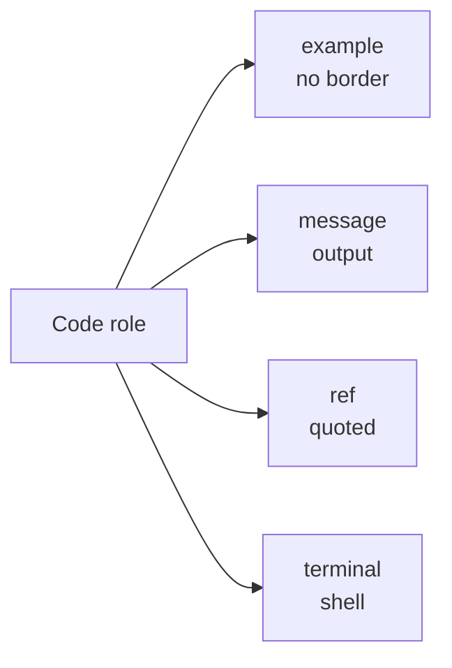
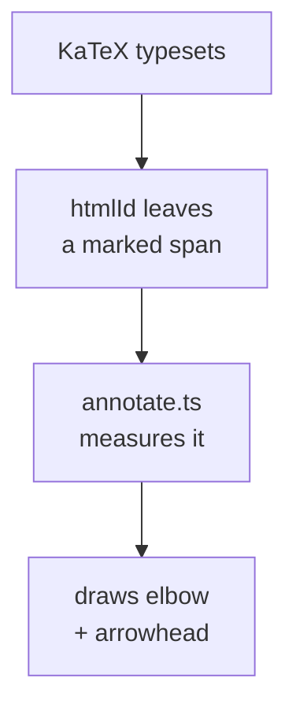

--- note Title
This deck is the component reference: every slide shows one building block and
what it renders to. Open this panel on any slide (the **?** button, or press
**i**) to see the notes for it.

The panel has two tabs. **Notes** is the written-out explanation — it stays with
the deck and is meant to be read. **Presenter** is what you would say out loud;
it is the same content reveal.js puts in its speaker view.

Notes are markdown, and ` ```mermaid ` fences render as diagrams.
--- presenter
Say: "everything on the following slides is a component you can use in your own
deck." Point at the **?** in the corner and open it once so the room knows the
notes are there.

--- note Code
Four roles, one component. The role only changes the border colour and the
legend, so a deck reads consistently without anyone choosing colours per slide.


--- presenter
Worth calling out that `message` means "this is what the compiler said back",
not "this is important". People reach for it as a highlight otherwise.

--- note Example
`example` is the default and draws no border, so plain code on a slide stays
quiet. Use it for the thing being discussed; use the other roles for everything
around it.
--- presenter
This is the one you will use most.

--- note Message
`message` is for output — what Lean printed. The green edge and the "Message"
legend tell the audience they are looking at a result rather than source.
--- presenter
Pair it with the example above it: "we ran that, and this came back."

--- note Reference
`ref` is for material quoted from Lean's own source or documentation. The grey
edge marks it as "not our code" — useful when a slide shows a class definition
you are about to instantiate.
--- presenter
Don't read a `ref` block aloud line by line. Point at the one line that matters.

--- note Terminal
`terminal` takes a `language` too, usually `sh`. The dark blue edge separates
"type this into a shell" from "put this in your file".
--- presenter
Mention that the `$` is a prompt, not part of the command — someone always
copies it.

--- note Snippet
This is the important one. `CodeSnippet` pulls a named block out of the
handout instead of restating it, so the slide and the file the audience is
following cannot drift apart.

Mark blocks in the handout like this:

```
--- snippet Function
def f x = x + 2
--- end
```

then show one with `<CodeSnippet code={snippets} key="Function" />`. The legend
is the snippet name, so the audience can find it in their copy.

`npm run check:snippets` fails the build if a slide asks for a snippet that no
handout defines, and warns about handout blocks no slide ever shows.
--- presenter
Tell people to open the handout now if they have not. The legend on the box is
the name to search for.

--- note Notes
A note is an aside: a remark that is worth saying but is not the point of the
slide. The role picks both the colour and the character in the corner.

| Role | Character |
| --- | --- |
| `program` | the programmer |
| `math` | the mathematician |
| `metaprog` | the metaprogrammer |
| `kernel` | the kernel programmer |
--- presenter
Don't dwell on a note slide. If it needs more than a sentence it is not a note,
it is a slide.

--- note Program note
`program` notes are the practical ones — a syntax quirk, a flag, something that
will bite you at the keyboard. The programmer stands in the bottom-left.
--- presenter
These are the ones people photograph. Pause a beat longer than feels necessary.

--- note Math note
`math` notes are the ones about why something is true rather than how to type
it. The mathematician stands in the bottom-right.
--- presenter
Signal the switch in register: "this next bit is not something you need to
type, it is something to believe."

--- note Metaprog note
`metaprog` notes are about the language looking at itself — macros, elaboration,
`#print`, the tactics that write your proofs. The metaprogrammer stands in the
bottom-left.
--- presenter
These are the ones that make people either delighted or uneasy. Read the room.

--- note Kernel note
`kernel` notes are about what the trusted core actually checks, and what it does
not. The kernel programmer stands in the bottom-right.
--- presenter
Use this role sparingly. If every note is about the kernel, none of them are.

--- note Annotations
Annotations label parts of a formula in place, rather than restating it in
prose underneath.

Write the formula with `\htmlId{name}{…}` around the part to be labelled, then
add an `<Annotation target="name">` for each. The connectors are drawn at
runtime, once KaTeX has laid the formula out, so they land in the right place
at any zoom.



`left` and `below` control which way a label grows, which is how four labels
fit around one small formula without colliding.
--- presenter
Point at each label in turn rather than reading the rule. The inference line at
the bottom is deliberately long — it shows the label wrapping under the
formula instead of squashing it.
